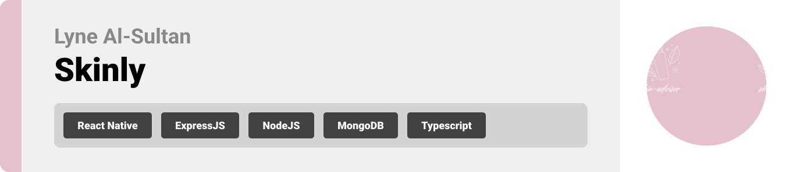

<br><br>

<!-- project philosophy -->


###

> Skinly is an app that provides users with a personalized skincare experience by detecting skin type, analyzing the compatibility of ingredients with skin types, and searching for products across multiple platforms.


### User Stories
#### User

- As a user, I want to upload an image of my face, so I can detect my skin type.

- As a user, I want to scan product ingredients using OCR, so I can see if they are suitable for my skin type.

- As a user, I want to compare products across multiple online platforms to purchase the best skincare products.


#### Company
- As a company, I want to see my products listed on the platform.

- As a company, I want to add advertisements for my products to increase visibility and sales.

- As a company, I want to preview my advertisements before publishing them to ensure accuracy and appeal.


#### Admin
- As an admin, I want to add and remove companies to manage partnerships effectively.

- As an admin, I want to see the percentage and numbers of users engaging with the platform.

- As an admin, I want to manage users to ensure a smooth and secure experience.

<br><br>
<!-- Tech stack -->


###  Here's a brief high-level overview of the tech stack the app uses:

- This project utilizes [React Native](https://reactnative.dev/) with [Expo](https://expo.dev/) for app development. React Native is a powerful JavaScript library that enables the creation of cross-platform mobile applications using a single codebase for both iOS and Android. Expo enhances the development experience by offering a suite of tools and services to streamline building, testing, and deploying apps efficiently.

- For persistent storage (database), the app uses [MongoDB](https://www.mongodb.com/), a NoSQL database, which allows us to store and manage flexible and scalable data structures.

- To handle backend routes and API calls, the app primarily uses [Nest.js](https://nestjs.com/), a progressive Node.js framework for building efficient, reliable and scalable server-side applications.

  - [Django](https://www.djangoproject.com/) is utilized for specific functionalities, including OCR and detecting the user’s skin type using a trained model.

- The app uses [ React Native Paper](https://reactnativepaper.com/) for the design and front-end components, providing a modern, responsive, and accessible user interface based on Material Design principles.
<!--
- The app uses the font ["Poppins"](https://fonts.google.com/specimen/Poppins) as its main font, offering a clean and modern design aesthetic that aligns with the material design guidelines.
 -->

<br><br>
<!-- UI UX -->


###

> We designed Skinly using wireframes and mockups, iterating on the design until we reached the ideal layout for easy navigation and a seamless user experience.

- Project Figma design [figma](https://www.figma.com/design/ttfDpBRMu1UyAUBhCscrGU/Skinly?node-id=4-7&node-type=frame&t=lAF5lspsO8l54lar-0)


### Mockups
| Home screen  | Menu Screen | Order Screen |
| ---| ---| ---|
|  |  |  |

<br><br>

<!-- Database Design -->


###  Architecting Data Excellence: Innovative Database Design Strategies:

<!-- - Insert ER Diagram here -->


<br><br>


<!-- Implementation -->


### User Screens (Mobile)
| Login screen  | Register screen | Landing screen | Loading screen |
| ---| ---| ---| ---|
|  |  |  |  |
| Home screen  | Menu Screen | Order Screen | Checkout Screen |
|  |  |  |  |

### Admin Screens (Web)
| Login screen  | Register screen |  Landing screen |
| ---| ---| ---|
|  |  |  |
| Home screen  | Menu Screen | Order Screen |
|  |  |  |

<br><br>


<!-- Prompt Engineering -->


###  Mastering Interaction: Unveiling the Power of Prompt Engineering:

-
<br><br>

<!-- AWS Deployment -->


###  Efficient Deployment: Unleashing the Potential with AWS Integration:

-

<br><br>

<!-- Unit Testing -->

<!-- How to run -->
<!-- 

> To set up Skinly app locally, follow these steps:

### Prerequisites

This is an example of how to list things you need to use the software and how to install them.
* npm
  ```sh
  npm install npm@latest -g
  ```

### Installation

_Below is an example of how you can instruct your audience on installing and setting up your app. This template doesn't rely on any external dependencies or services._

1. Get a free API Key at
2. Clone the repo
   git clone [github](https://github.com/your_username_/Project-Name.git)
3. Install NPM packages
   ```sh
   npm install
   ```
4. Enter your API in `config.js`
   ```js
   const API_KEY = 'ENTER YOUR API';
   ```

Now, you should be able to run Skinly app locally and explore its features. -->
